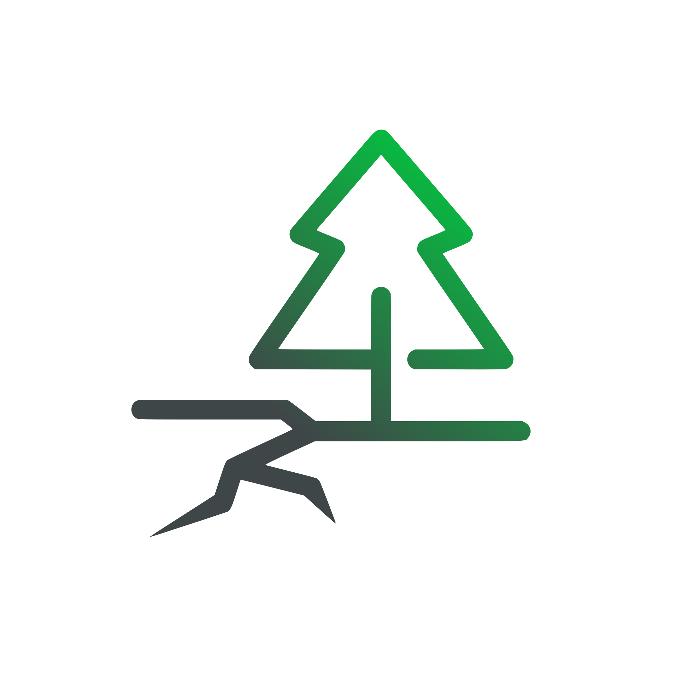

  
  # GeoRisk
  &nbsp;
     
    
    

## About the Project

Georisk is a webapp based on [French Georisque Government API](https://api.gouv.fr/les-api/api-georisques) to display risks for a selected location in France. The mission is to democratize risk analysis . The objective is to create a user-friendly and inclusive platform, allowing everyone to visualize and stay informed about constant risk evoltion in area.

## Risks Analysed

All of risk's supported are presents in this [file](RISKS.md).

## Roadmap 🎯

- ✅ Parallax Background
- ✅ API Requesting
  - ✅ API Localisation
  - ✅ API Georisque
  - ✅ APIs convergence in own nuxt integrated API
- ⏳ API Interpretation
  - ✅ API Risk display
  - ✅ API Risk history
- ✅ Responsive Design

## How to Contribute 🤝

We believe in the power of collaboration. If you share our vision and want to contribute to making risk analysis acessible to everyone.

Join us in this crucial mission !

## Support the Project ⭐

If you find this project useful or interesting, we encourage you to give it a ⭐️ on GitHub. It only takes a second but can greatly help increase the project's visibility.

If you're particularly excited about our mission to make first aid accessible to everyone, consider contributing further by [**becoming a contributor**] or by sharing the project with your colleagues and friends.

Thank you very much for your support! 🌟
